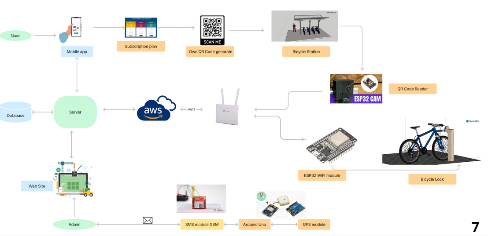

# Pera-Ride

---

## Team

- E/19/495 [email](e19495@eng.pdn.ac.lk) [A.G.D.Chamuditha]
- E/19/405 [email](e19405@eng.pdn.ac.lk) [T.M.R.S.Thennakoon]
- E/19/465 [email](e19167@eng.pdn.ac.lk) [R.M.S.Dilshan]
- E/19/227 [email](e19240@eng.pdn.ac.lk) [M.P.J.Madushanka]
- E/19/091 [email](e19431@eng.pdn.ac.lk) [P.A.M.Dissanayake]

## Table of Contents

1. [Introduction](#introduction)
2. [Control & Data Flow](#control-&-data-flow)
3. [Key Featuers](#key-featuers)
4. [User Experince](#user-experince)
5. [Links](#links)

---

## Introduction

Bicycle use for regular transportation is promoted by many large cities worldwide as a way to combat growing automobile congestion and the air pollution that results from it. Riding a bicycle provides city inhabitants with additional health benefits by increasing physical activity in addition to addressing the primary difficulties already discussed. Similar needs have been identified in Sri Lankan cities and universities, where thousands of residents regularly need to commute short- to medium-distances.

At the Department of Computer Engineering, our team is creating PeraRide, a comprehensive automated bicycle sharing system that will allow subscribers who are the students of the university to easily check out and return bikes within the university area

> 
> 

## Solution Architecture

High Level Architecture

> 

## Control & Data Flow

### Data Flow

> 

## Key Featuers

QR scanning automatic lock  
GPS tracking system  
User friendly mobile app for users  
Web application for admins  
Notification System  

## QR Scanner And Bicycle Lock

> 

## Gps tracking system

> 

