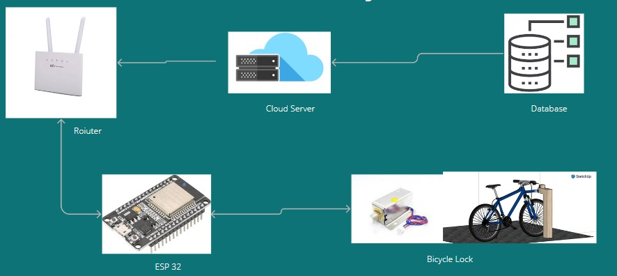

# Pera-Ride

---

## Team

- E/19/495 [email](e19495@eng.pdn.ac.lk) [A.G.D.Chamuditha]
- E/19/405 [email](e19405@eng.pdn.ac.lk) [T.M.R.S.Thennakoon]
- E/19/465 [email](e19167@eng.pdn.ac.lk) [R.M.S.Dilshan]
- E/19/227 [email](e19240@eng.pdn.ac.lk) [M.P.J.Madushanka]
- E/19/091 [email](e19431@eng.pdn.ac.lk) [P.A.M.Dissanayake]

## Table of Contents 

1. [Introduction](#introduction)
2. [Control & Data Flow](#control-&-data-flow)
3. [Key Featuers](#key-featuers)
4. [User Experince](#user-experince)
5. [Links](#links)

---

## Introduction

PeraRide, developed by the Department of Computer Engineering, stands as a pioneering solution to address the transportation challenges faced by the residents and students of Sri Lankan cities and universities. Recognizing the increasing need for sustainable and efficient commuting options, PeraRide establishes a comprehensive automated bicycle sharing system tailored specifically for the university environment. The system is designed to provide students with a convenient and eco-friendly means of transportation within the university area, alleviating the strain on conventional modes of commuting.

With PeraRide, students can effortlessly check out and return bicycles, fostering a culture of accessibility and promoting an active lifestyle. This initiative not only contributes to the reduction of automobile congestion and air pollution within the university premises but also encourages physical activity among students. By integrating technology into the traditional concept of bicycle sharing, the system enhances efficiency, making it easier for users to incorporate cycling into their daily routines.

As the world grapples with the environmental and health implications of increased urbanization, PeraRide serves as a model for sustainable transportation solutions, aligning with the global trend of promoting cycling as a viable alternative to traditional modes of commuting. The Department of Computer Engineering's commitment to innovation and addressing real-world challenges is evident in the development of PeraRide, marking a significant step toward creating a more sustainable and health-conscious university environment.

> 
> 

## Problem

 Students face challenges in travelling around the university premises.  
 Inefficiencies in university commuting.  
 Insufficient parking spaces.  

## Solution Architecture

High Level Architecture

> 

## Control & Data Flow

### Data Flow

> 

## Key Featuers

QR scanning automatic lock  
GPS tracking system  
User friendly mobile app for users  
Web application for admins  
Notification System  

## QR Scanner And Bicycle Lock

> 

## Gps tracking system

> 

## Advising Lecturers

Dr Isuru Nawinna

## Links

- [Project Repository](https://github.com/cepdnaclk/e19-3yp-Pera-Ride)
- [Project Page](https://cepdnaclk.github.io/e19-3yp-Pera-Ride/)
- [Department of Computer Engineering](http://www.ce.pdn.ac.lk/)
- [University of Peradeniya](https://eng.pdn.ac.lk/)

