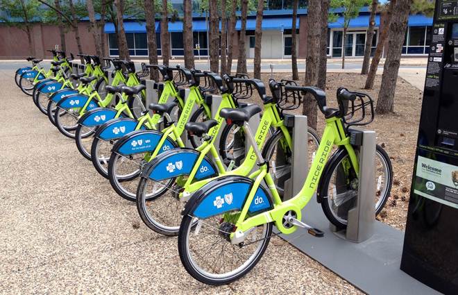
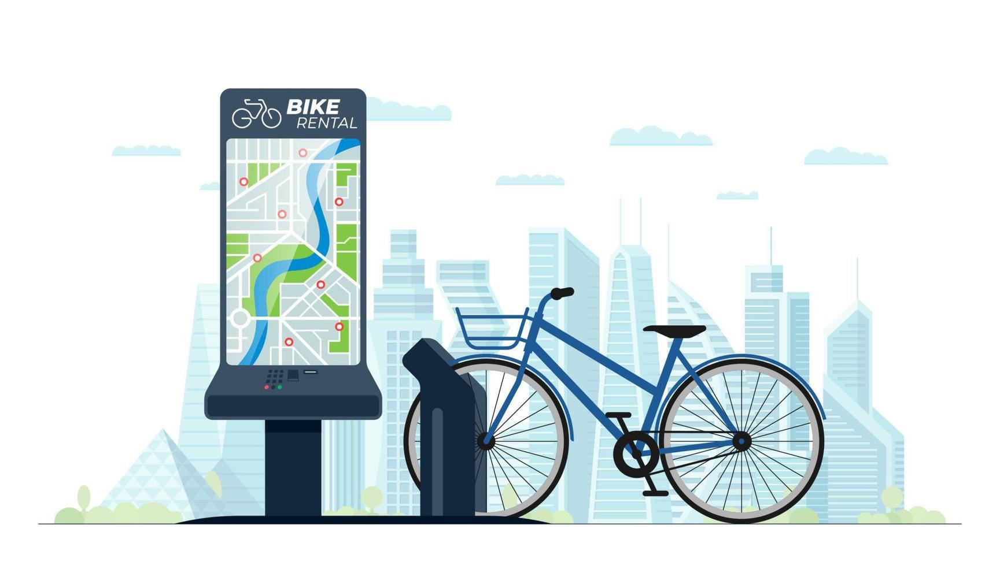
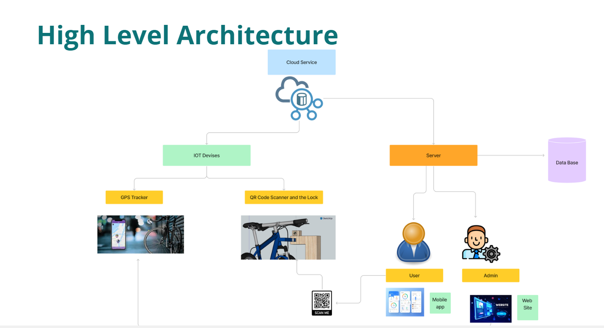
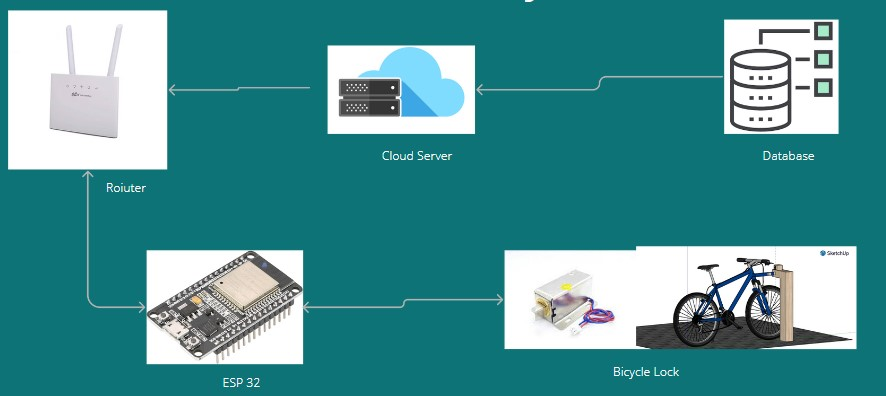
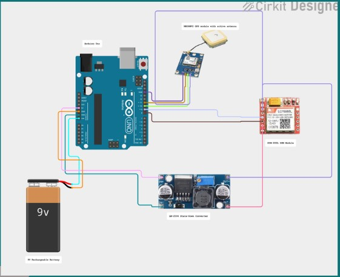

[comment]: # "This is the standard layout for the project, but you can clean this and use your own template"

# Project Title

---

## Team
-  E/19/495, A.G.Dulshan Chamuditha, [email](e19495@eng.pdn.ac.lk)
-  E/19/405, T.M.R.S.Thennakoon, [email](e19405@eng.pdn.ac.lk)
-  E/19/465, R.M.S.Dilshan, [email](e19465@eng.pdn.ac.lk)
-  E/19/227, M.P.J.Madushanka, [email](e19227@eng.pdn.ac.lk)
-  E/19/091, P.A.M.Dissanayake, [email](e19091@eng.pdn.ac.lk)

<!-- Image (photo/drawing of the final hardware) should be here -->

<!-- This is a sample image, to show how to add images to your page. To learn more options, please refer [this](https://projects.ce.pdn.ac.lk/docs/faq/how-to-add-an-image/) -->

<!--  -->

#### Table of Contents
1. [Introduction](#introduction)
2. [Solution Architecture](#solution-architecture )
3. [Hardware & Software Designs](#hardware-and-software-designs)
4. [Testing](#testing)
5. [Detailed budget](#detailed-budget)
6. [Conclusion](#conclusion)
7. [Links](#links)

## Introduction

<iframe width="560" height="315" src="https://www.youtube.com/embed/6XMMViNymo0?si=cfR05esrMx-4IZQ-](https://youtu.be/F7IAU2Zsg6I" title="YouTube video player" frameborder="0" allow="accelerometer; autoplay; clipboard-write; encrypted-media; gyroscope; picture-in-picture; web-share" allowfullscreen></iframe>

Bicycle use for regular transportation is promoted by many large cities worldwide as a way to combat growing automobile congestion and the air pollution that results from it. Riding a bicycle provides city inhabitants with additional health benefits by increasing physical activity in addition to addressing the primary difficulties already discussed. Similar needs have been identified in Sri Lankan cities and universities, where thousands of residents regularly need to commute short- to medium-distances.

At the Department of Computer Engineering, our team is creating PeraRide, a comprehensive automated bicycle sharing system that will allow subscribers who are the students of the university to easily check out and return bikes within the university area  

> 
> 

## Solution Architecture

> 

## Hardware and Software Designs

## QR Scanner And Bicycle Lock

> 

## Gps tracking system

> 

## Testing

Testing is done on hardware and software.

#### Software Testing Strategy for Bicycle sharing system

Our project utilizes a comprehensive testing strategy to ensure the reliability and performance of the Pera-Ride software. This includes:

Unit Testing: Identifies and fixes bugs within individual units before integration, ensuring fundamental functionalities work as intended. This minimizes the likelihood of unexpected issues arising during live events.

Integration Testing: Verifies seamless communication between various components of the system, including user registration, QR and lock, Gps tracking, and dashboards. This ensures smooth data flow and prevents compatibility issues.

End-to-End Testing: Simulates user journeys from registration to QR scanning and data analysis. This identifies hidden issues with user flows and functionalities, guaranteeing a seamless user experience.

Performance Testing: Evaluates system scalability under high load conditions, simulating large numbers of attendees and concurrent sessions. This ensures the system can handle peak demands without compromising responsiveness.

Cross-Browser Testing: Validates the application's functionality across various browsers and devices. This identifies browser-specific bugs and compatibility issues, ensuring widespread accessibility and consistent user experience.

By implementing this comprehensive testing strategy, we aim to deliver a robust and user-friendly bicycle sharing platform that guarantees a successful and enjoyable event experience for everyone involved.

## Detailed budget

All items and costs

| Item          | Quantity  | Unit Cost  | Total  |
| ------------- |:---------:|:----------:|-------:|
| Sample item   | 5         | 10 LKR     | 50 LKR |

## Conclusion

What was achieved, future developments, commercialization plans

## Links

- [Project Repository](https://github.com/cepdnaclk/e19-3yp-Pera-Ride)
- [Project Page](https://cepdnaclk.github.io/e19-3yp-Pera-Ride/)
- [Department of Computer Engineering](http://www.ce.pdn.ac.lk/)
- [University of Peradeniya](https://eng.pdn.ac.lk/)

[//]: # (Please refer this to learn more about Markdown syntax)
[//]: # (https://github.com/adam-p/markdown-here/wiki/Markdown-Cheatsheet)
